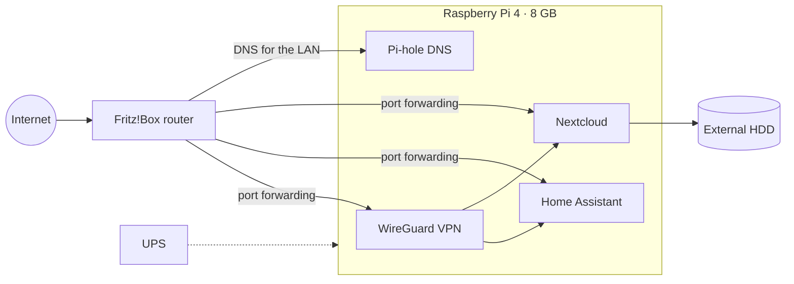

# HomeLab

Architecture and configuration notes for my self-hosted home server. I built it in 2021 to learn Linux administration, networking and basic hardening on a real network with real users (about 20 devices).

## Architecture

## Services

| Service | Role | Notes |
|---|---|---|
| **Pi-hole** | Network-wide DNS filtering | Set as the LAN DNS server on the Fritz!Box, so every device is filtered without any per-device setup |
| **WireGuard** | Remote access | VPN tunnel into the home network from outside |
| **Home Assistant** | Home automation | Runs as Hass.io |
| **Nextcloud** | Personal file sync | Data lives on an external HDD |

## Lessons learned

- **Power is part of the threat model.** A blackout destroyed the external HDD. After that I added a UPS and moved to regular snapshots, because a single disk with no backup is not storage.
- **Known trade-off.** Home Assistant and Nextcloud were reachable through direct port forwarding as well as through WireGuard. Putting them behind the VPN only would shrink the attack surface to a single UDP port.
- **DNS gives visibility.** Pi-hole's query log shows which domains every device on the network contacts, which makes it a cheap first monitoring tool.

## Roadmap

- [ ] Publish sanitized configs (Pi-hole, WireGuard, Home Assistant) with keys, IPs and hostnames removed
- [ ] Document the backup/snapshot procedure
